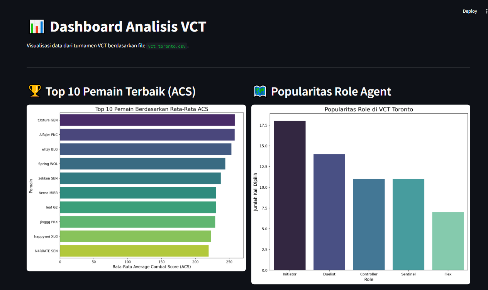
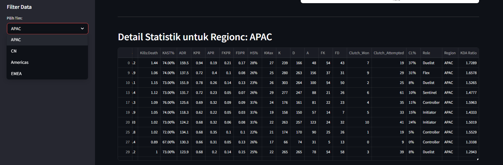
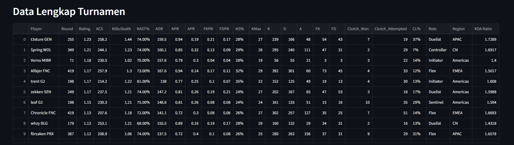

# VCTToronto-Data-Analysis
📊 Valorant Analytics Streamlit Dashboard
Sebuah dashboard interaktif yang dibuat menggunakan Streamlit untuk menganalisis dan memvisualisasikan performa pemain serta meta permainan dari data turnamen Valorant Champions Tour (VCT).

📝 Tentang Proyek Ini
Proyek ini bertujuan untuk mengubah data mentah dari sebuah turnamen VCT menjadi wawasan yang mudah dipahami. Dengan menggunakan Python dan library analisis data, dashboard ini menyajikan metrik-metrik kunci seperti pemain dengan performa terbaik dan role agent yang paling populer. Proyek ini dibangun sebagai portofolio untuk menunjukkan kemampuan dalam pengolahan data, analisis, dan visualisasi data interaktif.

🛠️ Dibuat Dengan
Berikut adalah teknologi dan library utama yang digunakan dalam proyek ini:

🚀 Fitur Utama
Analisis Performa Pemain: Menampilkan peringkat 10 pemain teratas berdasarkan Average Combat Score (ACS).

Visualisasi Meta Role: Grafik yang menunjukkan frekuensi pemilihan setiap role agent (Controller, Duelist, dll.) selama turnamen.

Tampilan Data Interaktif: Pengguna dapat melihat data mentah yang digunakan untuk analisis.

Desain Responsif: Dibangun dengan layout kolom agar nyaman dilihat di berbagai ukuran layar.

Result :

